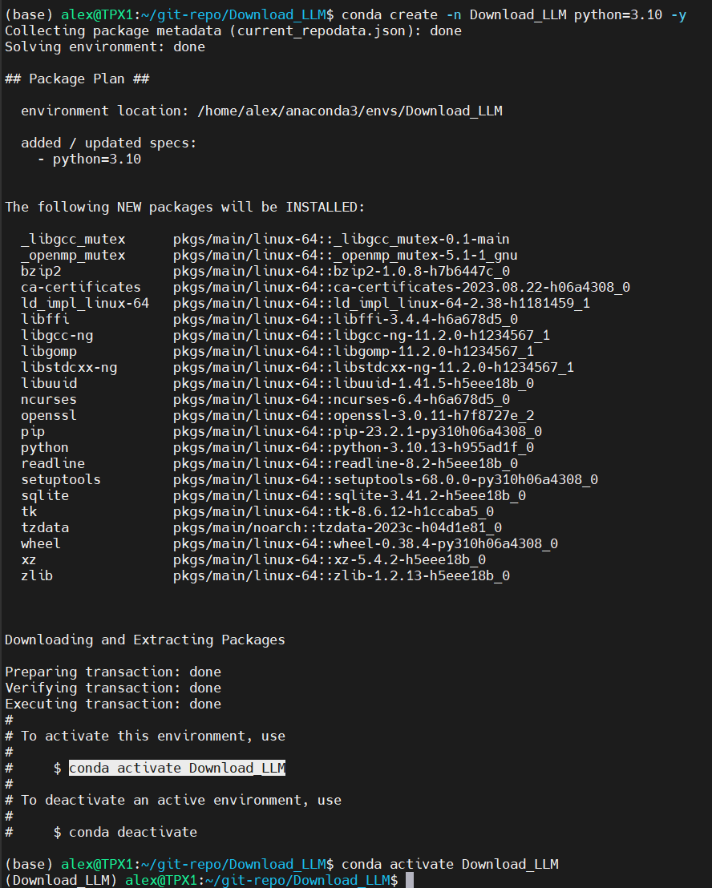
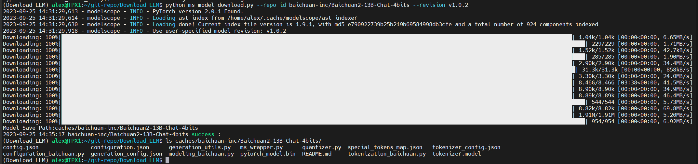

# 从ModelScope下载模型（断点续传）

## 1、安装python虚拟环境

```bash
# windows到Anaconda官网下载安装
# Linux用以下方法安装
wget https://repo.anaconda.com/archive/Anaconda3-2023.07-2-Linux-x86_64.sh
chmod +x Anaconda3-2023.07-2-Linux-x86_64.sh
./Anaconda3-2023.07-2-Linux-x86_64.sh
source ~/.bashrc
```

## 2、创建虚拟环境

```bash
 git clone https://github.com/alexhegit/Download_LLM.git
cd Download_LLM
conda create -n Download_LLM python=3.10 -y
conda activate Download_LLM
pip install -r requirements.txt -i https://pypi.mirrors.ustc.edu.cn/simple --trusted-host=pypi.mirrors.ustc.edu.cn
```

## 3、下载

```bash
conda Download_LLM
# 从modelscope魔塔社区下载模型，该社区由Aliyun支撑。请自行确认https://modelscope.cn/models中以支持的模型及模型ID
python ms_model_download.py --repo_id 模型ID --revision 模型版本
# 举例
python ms_model_download.py --repo_id baichuan-inc/Baichuan2-13B-Chat-4bits --revision v1.0.2
```

# 感谢
感谢开源社区，该项目直接借助了ModeScope&Aliyun, USTC, https://www.aliendao.cn/ 等国内开源力量。


# 示例操作

## 1. 创建conda虚拟环境


## 2. 下载模型



# 作者
Alex He(heye_dev@163.com)
2023-09-25

